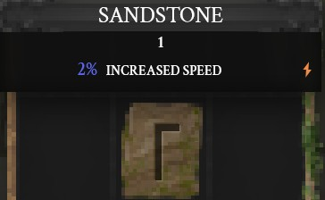
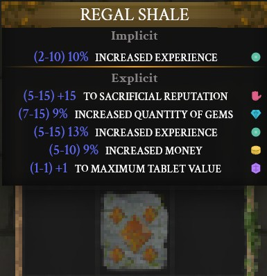
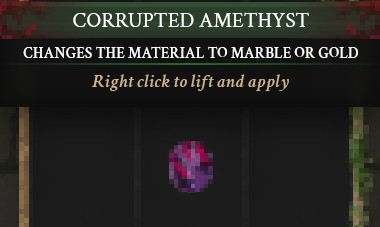
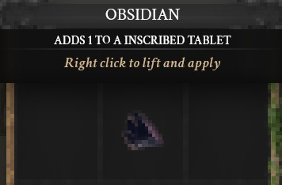
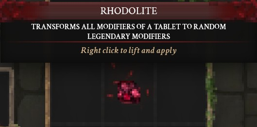
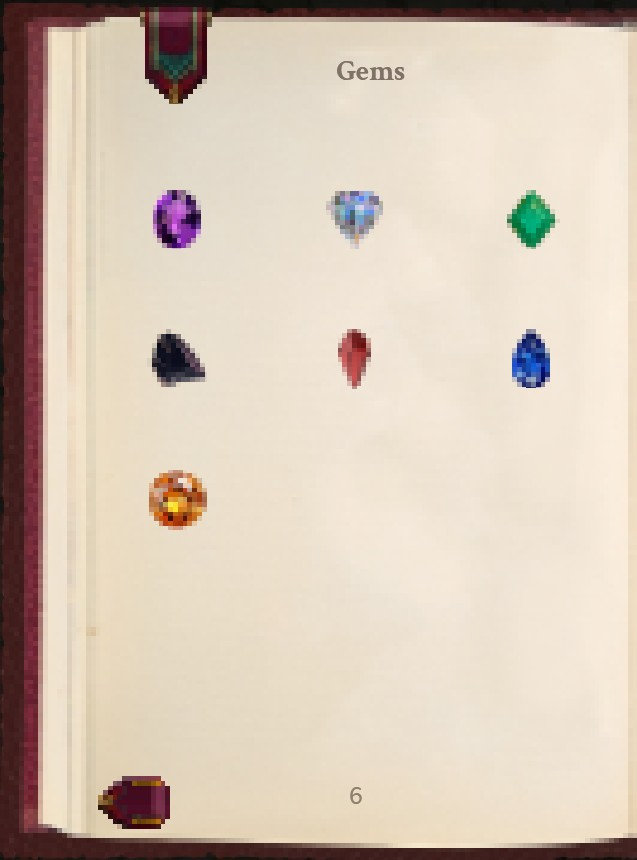
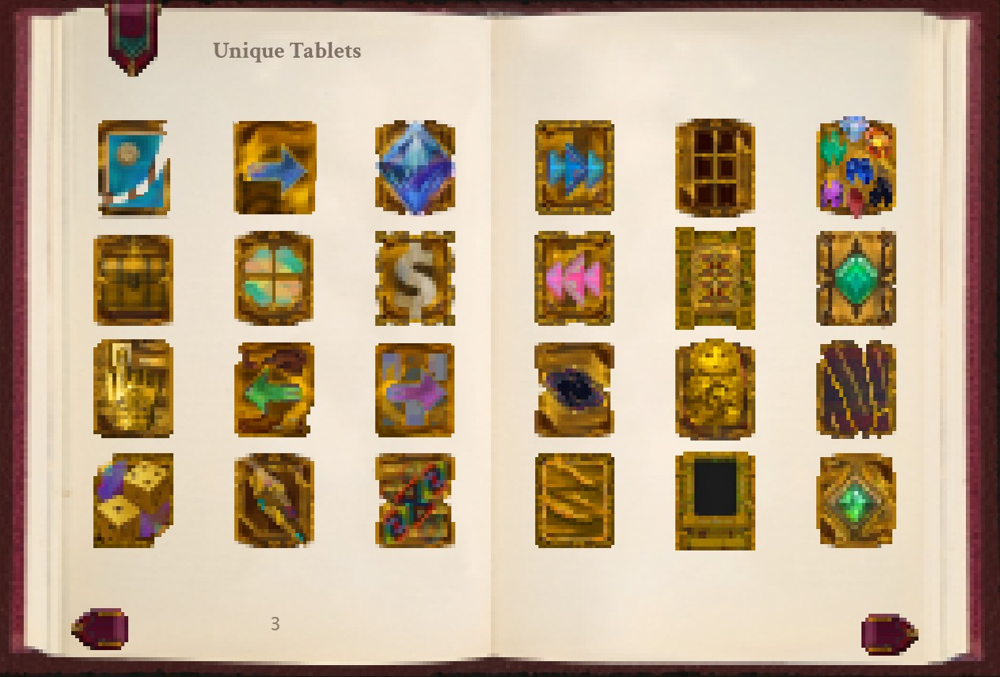
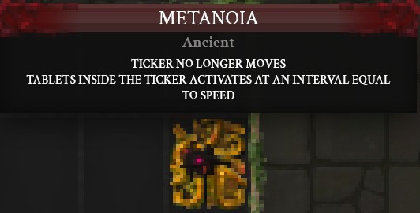
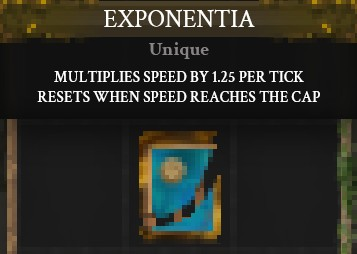
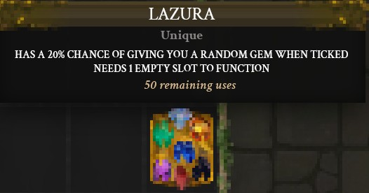

# Tabacus-Showcase

* This is a Pre-Alpha showcase of Tabacus and is a subset of the intended experience.

* Tabacus is a deckbuilding incremental game with simple elements, but highly emergent gameplay.

* Here is a link to 4 minutes of gameplay on a dev build: https://www.youtube.com/watch?v=iCK6xqckYYQ

### Core Stack

* React

* TypeScript

* Tauri

### State Management

* Zustand

* Redux Toolkit (currently being phased out)

### UI & Interaction

* MUI (Material UI)

* CSS

* dnd-kit (Modular drag-and-drop toolkit)

* xyflow (Node-based logic for skill tree implementations)

### Asset & Data Management

* IndexedDB (Local database for persistent client-side storage)

* TexturePacker: Used to bundle many small assets into a few texture atlases

    * Optimizes performance by reducing HTTP requests.

    * Prevents browser asset eviction.

    * Automation: Integrated via a custom PowerShell script for fully automated atlas generation.

### Testing

* Vitest

# The Game
Players place tablets on a grid to generate coins via a moving ticker.

Coins are spent on chests where you can choose between different items or upgrades to expand the grid.

The goal is to set up highly efficient and synergistic combos to generate more coins.

### Inscribed Tablets
You progress in the game by generating coins, which happens when the "ticker" surrounds an inscribed tablet.

https://github.com/user-attachments/assets/d1f722d0-8246-4aac-a536-d9b7d6ef38f5

### Modified Tablets
Tablets have modifiers that give various benefits.

Here is an example of a modified tablet; it does not generate coins when ticked but has space for more modifiers.

### Gems
Gems modify tablets in various ways.

https://github.com/user-attachments/assets/eb4a7d60-a677-4e74-b6c4-ca8c0b8e85d7

### Unique Tablets
There are more than 30 unique tablets in the game, each with a different effect.

This is how these 3 uniques interact.

In the video below, I unintentionally transformed the exponentia unique into another unique by using a ruby gem.

https://github.com/user-attachments/assets/cc314e30-13e7-4ca6-9b07-8300c3ab3636

### Hand Of Sacrifice

A hand which will destroy any item.

https://github.com/user-attachments/assets/5ad555b9-7c35-46ac-b196-20773af566ae

Unless?

https://github.com/user-attachments/assets/e9f68469-c86f-45a7-859a-863d3295f641

### Idols

Idols boost nearby tablets and have different sizes.

Larger idols give a larger boost.

https://github.com/user-attachments/assets/8614a688-610b-403a-96e8-e6c4e10979e1

